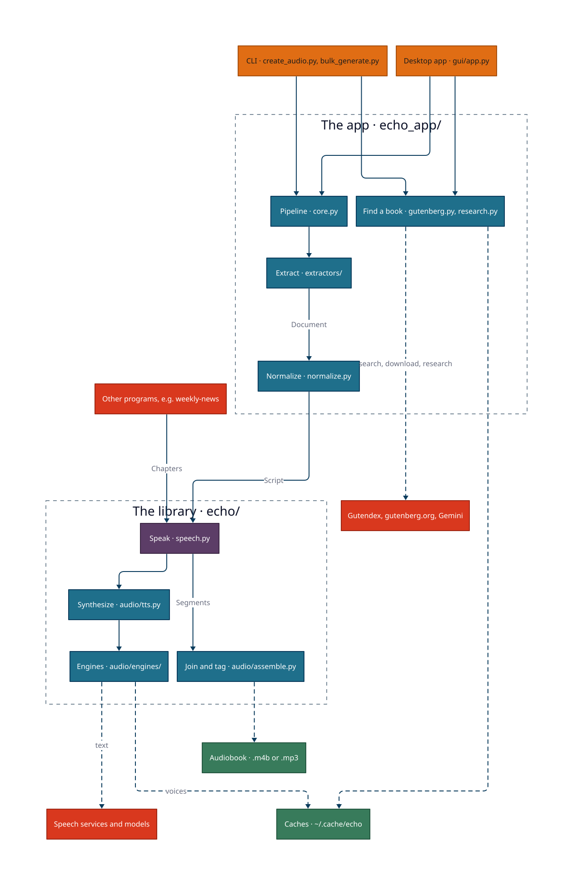
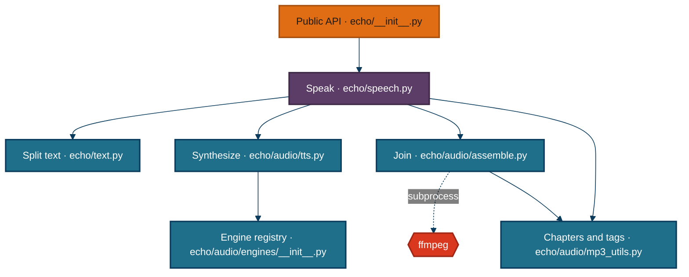
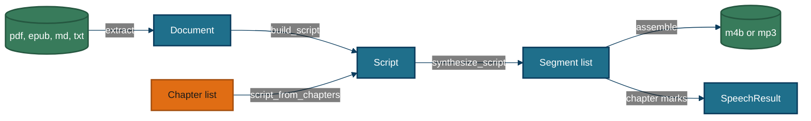

# echo — the maps

echo turns text into chaptered speech. It is two things in one repository: a **library** that any Python program can call to turn titled chapters of text into one audio file with chapter marks, and an **app** built on it that turns a PDF, EPUB, Markdown or text file (or a Project Gutenberg book, or a researched topic) into an audiobook.

This page is the map. The root [README](../README.md) is the manual and the landing page. [BACKLOG.md](../BACKLOG.md) is the decision log and work list, and [CLAUDE.md](../CLAUDE.md) records the traps. This page and its siblings describe only what exists.

Paths on these pages are relative to the repository root.

## At a glance

The two dashed boxes are the library/app boundary. The library never imports the app, and anything dotted leaves the process, to disk or to the network.

<picture>
  <source media="(prefers-color-scheme: dark)" srcset="diagrams/overview-dark.svg">
  
</picture>

| Container | Paths | What it does |
|---|---|---|
| Library | `echo/` | splits each chapter's text to the engine's limit, synthesizes every chunk with retries (and resume when asked), measures durations, builds chapter marks, joins the chunks with ffmpeg, writes chapters and tags, and returns each chapter's start and end |
| App pipeline | `echo_app/` | reads `.env`, extracts a file into structured blocks, strips page furniture and fixes punctuation for speech, groups blocks into chapters, optionally rewrites text with an LLM, then hands the result to the library |
| Book sources | `echo_app/gutenberg.py`, `echo_app/research.py` | searches and downloads Project Gutenberg books with cover art, or runs Gemini Deep Research and writes the report as Markdown, so the pipeline has a file to read |
| CLI | `create_audio.py`, `bulk_generate.py` | parses flags, picks one source, calls the pipeline, and exits non-zero on failure; the second converts every supported file in a folder |
| Desktop app | `gui/`, `echo_gui.py` | shows one source picker and the engine, voice, speed and format controls, queues conversions and runs them one at a time on worker threads, and previews voices |
| Packaging | `packaging/`, `echo_gui.spec` | downloads a static ffmpeg into `vendor/` and freezes the desktop app into `dist/Echo.app` with PyInstaller. It is not declared as a package in `pyproject.toml`. |

**Other programs are drawn as actors, not containers.** weekly-news calls `speak_chapters` in-process, and my-librarian runs `create_audio.py` as a subprocess. Neither lives in this repository.

<details>
<summary>Component view: the library (7 components)</summary>



| Module | Holds |
|---|---|
| `echo/__init__.py` | `__all__`, `__version__`, and a `NullHandler` on the `echo` logger |
| `echo/speech.py` | `speak_chapters`, `aspeak_chapters`, `speak_script`, `aspeak_script`, `Chapter`, `SpeechResult` |
| `echo/text.py` | `split_text` |
| `echo/audio/tts.py` | `synthesize_script`: retries, resume, bounded concurrency, progress |
| `echo/audio/engines/` | `edge`, `gemini`, `google-cloud`, `mlx`, `piper` behind one `SpeechEngine` protocol |
| `echo/audio/assemble.py` | ffmpeg concat, `atempo` speed, M4B chapters, SRT, durations |
| `echo/audio/mp3_utils.py` | ffmpeg discovery, ID3 `CHAP`/`CTOC` chapters, tags and cover art |

Engines and the app layer are drawn in [architecture.md](./architecture.md).

</details>

## How data moves



The app enters on the left with a file. A library caller enters in the middle with a list of chapters. Both meet at the Script.

<details>
<summary>What the data looks like at each step (6 types)</summary>

| Step | Type | Defined at | Real example |
|---|---|---|---|
| extract | `Document` | `echo_app/document.py:67` | the Kant EPUB: 1,339 blocks, backend `ebooklib` |
| build_script | `Script` | `echo/script.py:42` | the same book: 5 chapters, 175 utterances, 1,259,149 characters |
| library input | `Chapter` | `echo/speech.py:38` | `Chapter("Opening", "Good morning.")` |
| synthesize | `Segment` | `echo/script.py:81` | `chunk_bf771fad6d_00000.mp3`, 2,088 ms, one sentence timing |
| assemble | `ChapterMark` | `echo/audio/assemble.py:35` | `("Opening", 0, 2088)` |
| result | `SpeechResult` | `echo/speech.py:46` | 2 chapters, 4,176 ms, engine `edge` |

Full shapes, with captured examples and the invariants, are in [data.md](./data.md).

</details>

## Using it

echo reads a book to you. Give it a file, and it makes an audiobook with one chapter mark per chapter of the book. Most voices come from Microsoft's free online voices, so there is nothing to sign up for. Google's voices need a key, and two voices run entirely on your own computer.

```bash
pip install -r requirements.txt
python create_audio.py my_book.epub          # writes my_book.m4b beside it
python create_audio.py -g "Meditations"      # finds, downloads and reads a free classic
```

**Making an audiobook from a file.** Point the command at a PDF, EPUB, Markdown or text file. echo finds the chapters from the book's headings, leaves out tables, page numbers and footnote markers, and writes one file you can open in any audiobook player. If it is interrupted, running the same command again picks up where it stopped.

**Finding a book first.** Give a title instead of a file, and echo searches Project Gutenberg's free catalogue, downloads the best match with its cover, and reads it. The desktop app does the same from a search window, and lets you queue several books to run one after another.

Every workflow is traced step by step in [workflows.md](./workflows.md).

## Configuring it

| Knob | Where | Default | What changes |
|---|---|---|---|
| `DEFAULT_ENGINE` | `.env` | `edge` | which voice service reads the book |
| `DEFAULT_VOICE` | `.env` | `en-GB-SoniaNeural` | the edge voice used when none is given |
| `DEFAULT_SPEED` | `.env` | `1.0` | how fast the narrator reads, baked into the file |
| `DEFAULT_FORMAT` | `.env` | `m4b` | `m4b` or `mp3`; both carry chapter marks |
| `CHAPTER_HEADING_LEVEL` | `.env` | `2` | how deep a heading can be and still start a chapter |
| `GEMINI_API_KEY` | environment or `.env` | none | turns on the Gemini voices, LLM normalization and research |

Every knob, and the constants that only look like knobs, are in [configuration.md](./configuration.md).

## Where things live

```text
echo/            the library: speak_chapters, engines, synthesis, joining, tags
echo_app/        the app pipeline: extraction, normalization, Gutenberg, research, .env
gui/             the desktop app (PySide6)
create_audio.py  the command line
bulk_generate.py the command line for a whole folder
packaging/       ffmpeg vendoring and the PyInstaller build
resources/       demo documents for the tests; research output lands here (gitignored)
test/            the pytest suite
```

## Deeper

- [README.md](../README.md): installation, every engine, the Python API, and the library section
- [architecture.md](./architecture.md): component views and the layer rules
- [data.md](./data.md): payload cards, what is written to disk, invariants
- [workflows.md](./workflows.md): one trace per way in
- [configuration.md](./configuration.md): every knob
- [sources.md](./sources.md): every service off the machine, and attribution
- [BACKLOG.md](../BACKLOG.md): settled decisions and the work list
- [CLAUDE.md](../CLAUDE.md): traps and mechanisms, for whoever changes the code

*Generated from 8ed0ecc on 2026-09-28.*
