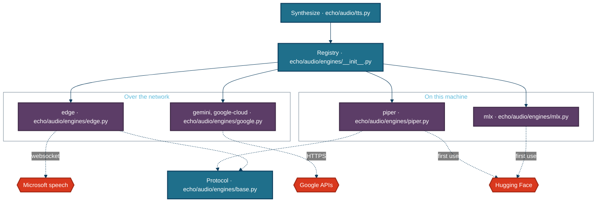
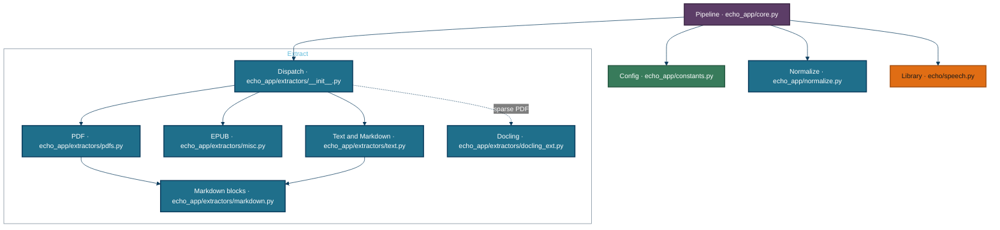
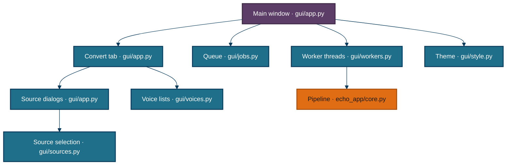

# Architecture

[OVERVIEW.md](./OVERVIEW.md) already draws the library's component view. This page draws the three containers with internal structure worth a diagram: the engines, the app pipeline, and the desktop app. The CLI (`create_audio.py`, `bulk_generate.py`) is one function each with no internal structure; its flags are in [configuration.md](./configuration.md). Packaging (`packaging/`) is two scripts run by hand at build time, described at the end.

## Engines

| Engine | Writes | At once | Longest request | Applies speed itself | Needs |
|---|---|---|---|---|---|
| `edge` | `.mp3` | 4 | 8,000 characters | yes, as a rate string | nothing |
| `gemini` | `.wav` | 2 | 6,000 characters | **no**, ffmpeg applies it | `GEMINI_API_KEY`, `[google]` extra |
| `google-cloud` | `.mp3` | 4 | 4,000 characters | yes | Application Default Credentials, `[google]` extra |
| `mlx` | `.wav` | 1 | 4,000 characters | yes | Apple Silicon, Python 3.13, `[mlx]` extra |
| `piper` | `.wav` | 1 | 4,000 characters | yes, via the model's length scale | `[piper]` extra |

**Engines are constructed on first use and cached for the life of the process.** `get_engine()` (`echo/audio/engines/__init__.py:96`) imports each engine's module inside a factory function, so importing the registry never loads mlx, onnxruntime or the Google SDKs. Aliases (`kokoro`, `offline`, `google` and others) resolve to the five names above.

**An engine says what is wrong before any audio is made.** `check_available()` raises `EngineUnavailable` with the install command or variable to set, and the GUI shows that text beside a greyed-out choice. The optional `check_voice()` (`echo/audio/engines/base.py`) catches a bad voice, such as a missing local Piper model, before the first chunk instead of after every chunk's retries.

**The longest request is a real limit, not a preference.** Google Cloud rejects requests over 5,000 bytes, so the library splits text to the smaller of the caller's chunk size and the engine's `max_chars`.

## The app pipeline

| Module | What it does |
|---|---|
| `echo_app/core.py` | resolves the engine and voice from `.env` defaults, extracts, applies the rules pass, builds the Script, then calls `speak_script` with the app's bitrate, retries and resume folder |
| `echo_app/extractors/__init__.py` | checks the file exists, dispatches on suffix, escalates a sparse PDF to Docling, refuses a file with no spoken text, and fills in the title from the filename |
| `echo_app/extractors/pdfs.py` | reads the page range, uses `pymupdf4llm` markdown when installed and PyMuPDF text otherwise, and runs Tesseract OCR on pages with no text layer |
| `echo_app/extractors/misc.py` | walks the EPUB spine in reading order and maps HTML tags to block kinds |
| `echo_app/extractors/text.py` | unwraps paragraphs, strips Project Gutenberg boilerplate, and detects headings in plain text by strict rules |
| `echo_app/extractors/markdown.py` | labels markdown lines as headings, paragraphs, quotes, lists, tables and code, and unwraps links to their text |
| `echo_app/normalize.py` | marks running headers and page numbers unspoken, fixes dashes, quotes and footnote markers, groups blocks into chapters, folds stub sections into neighbours, and runs an optional guarded LLM rewrite |

**Structure comes from parsers, not guesses.** Headings come from EPUB tags, from markdown, and from `pymupdf4llm`'s markdown for PDFs. Only plain text is inferred, by `_looks_like_heading()` (`echo_app/extractors/text.py:65`), which is deliberately strict.

**The app reads configuration; the library does not.** `echo_app/constants.py` calls `load_dotenv()` at import and turns `.env` into module constants, and `echo_app/core.py` passes them into library calls as arguments. That is why importing `echo` alone changes nothing in the environment.

## The desktop app

| Component | Defined at |
|---|---|
| Main window: queue button, progress, log panel, preview | `MainWindow`, `gui/app.py:1196` |
| Convert tab: source, engine, voice, speed, format, output | `ConvertTab`, `gui/app.py:889` |
| Source dialogs | `GutenbergDialog` `gui/app.py:449`, `ResearchDialog` `gui/app.py:631`, `QueueDialog` `gui/app.py:786`, `SettingsDialog` `gui/app.py:253` |
| Queue model | `ConversionQueue`, `gui/jobs.py:41` |
| Worker threads | `ConversionWorker`, `PreviewWorker`, `GutenbergSearchWorker`, `GutenbergDownloadWorker`, `ResearchWorker` in `gui/workers.py` |

**Every blocking call runs on a worker thread, and the progress bar is read from the log.** A worker attaches a temporary handler to the `echo` and `echo_app` loggers, forwards each line to the log panel, and parses `Progress Report: NN%` into the bar (`gui/workers.py:25`). That exact string is a contract between `echo/audio/tts.py` and the GUI.

**Conversions run one at a time on purpose.** Within a book the synthesizer already uses the engine's full concurrency, so two books at once would double the connections to the same service without finishing sooner. The queue refuses a second job that writes to the same output file.

**The dropdowns come from the registries.** The engine and normalizer menus are built from `available_engines()` and `available_normalizers()`, so a choice that needs setup appears greyed out with the reason in its tooltip.

## Packaging

`packaging/fetch_ffmpeg.py` downloads a static ffmpeg for this platform into `vendor/ffmpeg/`, and `packaging/build_app.py` runs PyInstaller on `echo_gui.spec`. The spec bundles `echo/data/voices.csv`, the vendored ffmpeg, and whichever optional engines are installed in the build environment. Engines are imported lazily, so static analysis cannot see them, and the spec probes for each one.

## Conventions across the system

**The dependency direction is one way: `gui` and the CLI import `echo_app`, `echo_app` imports `echo`, and `echo` imports neither.** `test/test_speech.py` checks this in a subprocess, together with "importing echo reads no `.env`".

**Every choice that can be unavailable says so in the same shape.** Engines, normalizers and Deep Research each have `check_available()` that raises with a fix-it message and `is_available()` that returns `(ok, reason)` for a UI.

**Failures are loud, and a finished book is never missing content.** Synthesis attempts every chunk before raising, `speak_script` refuses to assemble when a chunk is missing, and an LLM rewrite that drifts is discarded rather than trusted.

*Generated from 8ed0ecc on 2026-09-28.*
