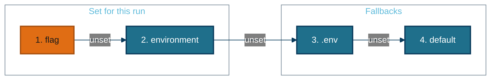

# Configuration

The **library** takes its settings as arguments and reads no configuration file. The **app** (the CLI and the desktop app) reads a `.env` file and the environment, and passes what it finds into the library. The one exception is engine credentials and model choices, which each engine reads from the environment when it is first used.

## Where settings come from

A flag here also means a GUI control, and `.env` means the file in the current directory.

**`.env` is read from the current directory, not from beside the code.** `echo_app/constants.py` calls `load_dotenv()` at import. Run from anywhere else, the repository's `.env` is not found: checked on 2026-09-28 by importing the module from `/tmp`, where `GEMINI_API_KEY` came back empty. The frozen `Echo.app` starts with `/` as its current directory, so it never sees the repository's `.env`, and a key has to reach it through the real environment. `load_dotenv()` never overrides a variable that is already set, which is why the environment ranks above the file.

## The library's arguments

`speak_chapters` and `speak_script` (`echo/speech.py`) take these. The defaults are plain constants in `echo/defaults.py`.

| Argument | Default | What changes |
|---|---|---|
| `engine` | `edge` | the registry name, or your own `SpeechEngine` object |
| `voice` | the engine's default | engine-specific voice id; for Piper also a path to a `.onnx` model |
| `speed` | `1.0` | rate multiplier; the engine applies it, or ffmpeg's `atempo` if the engine cannot |
| `fmt` | the output path's suffix | `mp3` or `m4b` |
| `title`, `author`, `cover` | none | written as tags and cover art |
| `bitrate` | `64k` | used whenever audio is re-encoded |
| `chunk_size` | `8000` characters | upper bound per request, before the engine's own limit |
| `work_dir` | the system temp directory | parent for the private scratch folder |
| `resume_dir` | none | opt-in folder whose chunks survive a failure and are reused |
| `transcript` | `false` | also write an `.srt`, when the engine reports timings |
| `max_retries`, `retry_backoff` | `3`, `2.0` seconds | attempts per chunk, and the first delay (doubling after) |
| `on_progress` | none | called with `(done, total)` in utterances |

## The app's `.env` and environment variables

Output and structure (7)

| Variable | Default | What changes |
|---|---|---|
| `DEFAULT_OUTPUT_FOLDER` | beside the source | where audiobooks are written; `~` is expanded |
| `DEFAULT_FORMAT` | `m4b` | `m4b` or `mp3` |
| `M4B_BITRATE` | `64k` | the bitrate passed to the library |
| `WRITE_TRANSCRIPT` | `false` | write an `.srt` without passing `--transcript` |
| `CHAPTER_HEADING_LEVEL` | `2` | the deepest heading that still starts a chapter |
| `MIN_CHAPTER_CHARS` | `400` | a shorter section folds into its neighbour; `0` keeps every heading |
| `DEFAULT_CHUNK_SIZE` | `8000` | the chunk size passed to the Script builder |

Synthesis (5)

| Variable | Default | What changes |
|---|---|---|
| `DEFAULT_ENGINE` | `edge` | the engine when `-e` is not given |
| `DEFAULT_VOICE` | `en-GB-SoniaNeural` | the voice when `-v` is not given, **for edge only**; other engines keep their own default |
| `DEFAULT_SPEED` | `1.0` | the speed when `-s` is not given |
| `DEFAULT_MAX_RETRIES` | `3` | attempts per chunk |
| `DEFAULT_RETRY_BACKOFF` | `2.0` | seconds before the first retry |

Engines, read by the engine itself (8)

| Variable | Default | Engine |
|---|---|---|
| `GEMINI_API_KEY`, or `GOOGLE_API_KEY` | none | `gemini`; also the gemini normalizer and Deep Research |
| `GEMINI_TTS_MODEL` | `gemini-2.5-flash-preview-tts` | `gemini` |
| `GOOGLE_CLOUD_VOICE` | `en-GB-Neural2-C` | `google-cloud` default voice |
| `GOOGLE_APPLICATION_CREDENTIALS` | the gcloud default login | `google-cloud`; read by Google's own client library |
| `MLX_TTS_MODEL` | `prince-canuma/Kokoro-82M` | `mlx` |
| `MLX_TTS_VOICE`, `MLX_LANG_CODE` | `bf_emma`, inferred from the voice | `mlx` |
| `PIPER_VOICE` | `en_GB-alan-medium` | `piper` default voice, or a `.onnx` path |
| `PIPER_VOICE_DIR` | `~/.cache/echo/piper` | `piper`, where downloaded voices are kept |

Text normalization (5)

| Variable | Default | What changes |
|---|---|---|
| `NORMALIZER` | `off` | `off`, `local` or `gemini` |
| `LOCAL_LLM_BASE_URL` | `http://localhost:1234/v1` | the OpenAI-compatible server for `local` |
| `LOCAL_LLM_MODEL`, `LOCAL_LLM_API_KEY` | `qwen3`, `not-needed` | sent to that server |
| `GEMINI_TEXT_MODEL` | `gemini-2.5-flash` | the model for `gemini` |
| `NORMALIZER_LENGTH_TOLERANCE` | `0.25` | how far a rewrite may change the length before it is discarded |

Book sources (6)

| Variable | Default | What changes |
|---|---|---|
| `GUTENBERG_DIR` | `~/.cache/echo/gutenberg` | the download cache; `~` is expanded |
| `RESEARCH_AGENT` | `standard` | `standard`, `max` or `pro` |
| `RESEARCH_AGENT_ID` | none | an explicit agent id, for when the dated previews are renamed |
| `RESEARCH_DIR` | `resources/research` | where kept reports go |
| `RESEARCH_POLL_SECONDS` | `15` | seconds between status checks |
| `RESEARCH_TIMEOUT_SECONDS` | `1800` | when a run is cancelled |

**Which voice is used, first match wins:** the `-v` flag or GUI choice, then `DEFAULT_VOICE` if the engine is edge, then the engine's own variable (`PIPER_VOICE`, `GOOGLE_CLOUD_VOICE`, `MLX_TTS_VOICE`), then the engine's built-in default. `gemini` has no variable and defaults to `Kore`.

**Which Gemini key is used:** `GEMINI_API_KEY`, then `GOOGLE_API_KEY`. Google Cloud TTS does not accept an API key at all; it needs Application Default Credentials.

## Command-line flags

create_audio.py (25)

| Flag | What it does |
|---|---|
| `file_path` | the source document |
| `-o`, `--output` | the audio file path |
| `-g`, `--gutenberg` | search Project Gutenberg for this title instead of a file |
| `--author` | narrow the Gutenberg search |
| `--gutenberg-id` | convert this exact book id |
| `--language` | catalogue language, default `en` |
| `--list-matches` | print what the search finds, with ids, and exit |
| `--prefer` | `epub` (default) or `text` edition |
| `-r`, `--research` | research this topic with Gemini Deep Research |
| `--agent` | research depth, default from `RESEARCH_AGENT` |
| `--name` | names the output file and title; required with `--research` |
| `-e`, `--engine` | the engine |
| `-v`, `--voice` | the voice |
| `-s`, `--speed` | 0.5 to 3 |
| `-f`, `--format` | `m4b` or `mp3` |
| `-n`, `--normalize` | `off`, `local` or `gemini` |
| `-m`, `--meta` | JSON with `title`, `author`, `image_path` |
| `--first-page`, `--last-page` | a PDF page range |
| `--force-ocr` | OCR every PDF page |
| `--docling` | extract with Docling |
| `--save` | also write the narrated text as `.txt` |
| `--transcript` | also write an `.srt` |
| `--no-resume` | ignore chunks from an interrupted run |
| `--list-voices`, `--list-engines` | print and exit |
| `--debug` | verbose logging |

`bulk_generate.py` takes a folder plus `-e`, `-v`, `-s`, `-f` and `--rename`, which normalizes source filenames in place before converting.

## Constants that are not configurable

| Constant | Value | Where |
|---|---|---|
| Chunks synthesized at once | edge 4, gemini 2, google-cloud 4, mlx 1, piper 1 | each engine's `max_concurrency` in `echo/audio/engines/` |
| Longest request per engine | edge 8,000, gemini 6,000, google-cloud, mlx and piper 4,000 characters | each engine's `max_chars` |
| Gemini audio format | 16-bit mono PCM at 24 kHz | `echo/audio/engines/google.py:33` |
| Speed range | 0.5 to 3.0 in the CLI and GUI; edge accepts 0.25 to 5 | `create_audio.py:24`, `gui/app.py:103`, `echo/audio/engines/edge.py` |
| Docling escalation | under 200 characters per PDF page | `echo_app/extractors/__init__.py:52` |
| OCR resolution | 200 dpi | `echo_app/extractors/pdfs.py:50` |
| A section counts as a stub | under 20% of the median section, as well as under `MIN_CHAPTER_CHARS` | `echo_app/normalize.py:41` |
| Local LLM probe and request timeouts | 2 seconds, 300 seconds | `echo_app/normalize.py:44`, `echo_app/normalize.py:307` |
| Gutenberg HTTP timeout and retries | 60 seconds, 3 attempts | `echo_app/gutenberg.py:35` |
| Research progress line | at least every 45 seconds | `echo_app/research.py:56` |
| Deep Research agent ids | dated previews, e.g. `deep-research-preview-04-2026` | `echo_app/research.py:44` |
| Preview sample text | two fixed sentences | `echo_app/core.py:74` |
| The progress log line | `Progress Report: NN%` | `echo/audio/tts.py`; the GUI parses it, so it must not change |

*Generated from 8ed0ecc on 2026-09-28.*
