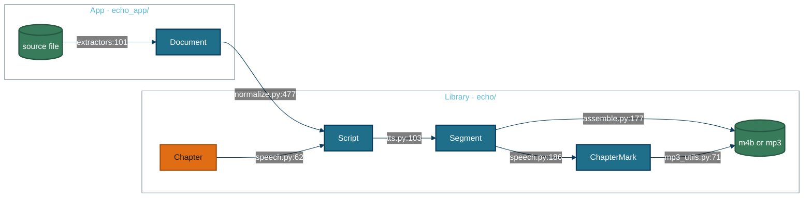

# Data

Every type here is a plain dataclass. Library types are in `echo/`, the app's extraction types in `echo_app/`. Each example was **captured from a run** on 2026-09-28: the app pipeline on `resources/demo_data/`, the edge engine live, and the Gutendex API live. None is written to shape.

## The flow



Edge labels are the producing `file:line`. In full: `echo_app/extractors/__init__.py:101`, `echo_app/normalize.py:477`, `echo/speech.py:62`, `echo/audio/tts.py:103`, `echo/speech.py:186`, `echo/audio/assemble.py:177` and `echo/audio/mp3_utils.py:71`.

## Payload cards

### `Document` — what a source file says, structurally

Defined at `echo_app/document.py:67`, with `Block` at `echo_app/document.py:51`. Written by `extract()` at `echo_app/extractors/__init__.py:101`.

| Field | Type | Notes |
|---|---|---|
| `blocks` | list of `Block` | each has `kind`, `text`, `level` (heading depth) and `page` (PDFs only) |
| `title`, `author` | text or none | the title falls back to the filename |
| `source_path` | path or none | |
| `provenance` | dict | which backend ran, page count, OCR pages and any OCR error |

A block's `kind` is one of `heading`, `paragraph`, `quote`, `list`, `table`, `figure`, `code`, `footnote` and `page_artifact`. Only the first four are spoken; the rest stay in the Document but are skipped when the Script is built.

<details>
<summary>Example: the Kant EPUB, and a PDF's provenance</summary>

Captured from `core.extract_document("resources/demo_data/critique_pure_reason-kant.epub")`, first four of 1,339 blocks:

```json
{
  "title": "The Critique of Pure Reason",
  "author": "Immanuel Kant",
  "provenance": {"backend": "ebooklib", "documents": 12, "gutenberg_stripped": true},
  "blocks": [
    {"kind": "heading", "text": "The Critique of Pure Reason", "level": 1, "page": null},
    {"kind": "heading", "text": "By Immanuel Kant", "level": 2, "page": null},
    {"kind": "heading", "text": "Translated by J. M. D. Meiklejohn", "level": 4, "page": null},
    {"kind": "heading", "text": "Contents", "level": 2, "page": null}
  ]
}
```

Captured from `resources/demo_data/america_against_america_sample.pdf`:

```json
{"provenance": {"backend": "pymupdf4llm", "pages": 3, "ocr_pages": [], "ocr_error": null}}
```

</details>

### `Script` — what the narrator says, in chapters

Defined at `echo/script.py:42`, with `ScriptChapter` at `echo/script.py:30` and `Utterance` at `echo/script.py:18`. Written by `build_script()` at `echo_app/normalize.py:477` for the app, and by `script_from_chapters()` at `echo/speech.py:62` for library callers.

| Field | Type | Notes |
|---|---|---|
| `chapters` | list of `ScriptChapter` | each has a `title` and a list of `Utterance` |
| `title`, `author` | text or none | carried through to the tags |
| `Utterance.text` | text | no longer than the engine's limit |
| `Utterance.voice` | text or none | overrides the run's voice for one utterance; nothing sets it yet |

<details>
<summary>Example: the Kant EPUB as a Script</summary>

Captured from `core.build_script(doc, engine_name="edge")`:

```json
{
  "chapters": 5,
  "first_titles": ["PREFACE TO THE FIRST EDITION 1781", "PREFACE TO THE SECOND EDITION 1787", "Introduction", "I. TRANSCENDENTAL DOCTRINE OF ELEMENTS."],
  "utterances": 175,
  "characters": 1259149,
  "chapter_2_first_utterance": "PREFACE TO THE SECOND EDITION 1787.\n\nWhether the treatment of that por…"
}
```

The byline "By Immanuel Kant" did not become a chapter, and the chapter's own heading is spoken as its first words.

</details>

### `Chapter` — one titled span of text, from a library caller

Defined at `echo/speech.py:38`. Two fields, `title` and `text`, both plain text. Example, as weekly-news calls it: `Chapter("Opening", "Good morning.")`.

### `Segment` — one synthesized chunk on disk

Defined at `echo/script.py:81`, with `Timing` at `echo/script.py:71`. Written by `synthesize_script()` at `echo/audio/tts.py:103`.

| Field | Type | Notes |
|---|---|---|
| `index` | integer | position in reading order |
| `path` | path | `chunk_<digest>_<index>` plus the engine's suffix |
| `duration_ms` | integer | measured before any ffmpeg speed change |
| `timings` | list of `Timing` | start, end and text per sentence; only edge reports them |

<details>
<summary>Example: "Good morning." on edge</summary>

Captured from `synthesize_script` with `en-GB-RyanNeural`:

```json
{"index": 0, "path": "chunk_bf771fad6d_00000.mp3", "duration_ms": 2088,
 "timings": [{"start_ms": 100, "end_ms": 1687, "text": "Good morning."}]}
```

</details>

### `ChapterMark` and `SpeechResult` — what a library call returns

`ChapterMark` is defined at `echo/audio/assemble.py:35`, a named tuple of `(title, start_ms, end_ms)` in the output file's timeline. `SpeechResult` is defined at `echo/speech.py:46`: `path`, `chapters`, `duration_ms`, `transcript`, `engine`, `voice` and `segments`.

<details>
<summary>Example: a two-chapter call</summary>

Captured from `speak_chapters([Chapter("Opening", "Good morning."), Chapter("Close", "That is all.")], "d.mp3", engine="edge", voice="en-GB-RyanNeural", title="Digest")`:

```json
{"path": "d.mp3", "chapters": [["Opening", 0, 2088], ["Close", 2088, 4176]], "duration_ms": 4176,
 "transcript": null, "engine": "edge", "voice": "en-GB-RyanNeural", "segments": 2}
```

</details>

### `VoiceInfo` — one voice in a picker

Defined at `echo/audio/engines/base.py:20`. Returned by each engine's `voices()`.

<details>
<summary>Example: an edge voice</summary>

Captured from `get_engine("edge").voices()`, which reads `echo/data/voices.csv`:

```json
{"id": "en-GB-SoniaNeural", "engine": "edge", "name": "Sonia", "language": "en", "locale": "GB", "gender": "Female", "tags": "Friendly,Positive"}
```

</details>

### `GutenbergBook` and `DownloadedBook` — a catalogue record, and a book on disk

`GutenbergBook` is defined at `echo_app/gutenberg.py:116`, built from a Gutendex record. `DownloadedBook` is defined at `echo_app/gutenberg.py:160` and adds the local `path`, the `cover_path` and the format chosen.

<details>
<summary>Example: Meditations, id 2680</summary>

Captured live from `gutenberg.get(2680)`, first three formats shown:

```json
{"id": 2680, "title": "Meditations", "authors": ["Marcus Aurelius, Emperor of Rome"], "languages": ["en"],
 "download_count": 75988, "copyrighted": false,
 "formats": {"text/html": "https://www.gutenberg.org/ebooks/2680.html.images",
             "application/epub+zip": "https://www.gutenberg.org/ebooks/2680.epub3.images",
             "application/x-mobipocket-ebook": "https://www.gutenberg.org/ebooks/2680.kf8.images"}}
```

The author is left as "Marcus Aurelius, Emperor of Rome": `normalize_author()` refuses to reorder a name whose second half is a title.

</details>

### `ResearchResult` — a Deep Research report on disk

Defined at `echo_app/research.py:78`. **No example captured**: a run needs a Gemini key and takes several minutes. Fields are `name`, `topic`, `agent`, `text` (the narration source), `path`, `notes_path` (the cited report, when kept), `searches`, `elapsed_s` and `interaction_id`.

## Storage

echo has no database. Everything it keeps is a file or a folder.

| What | Where | Written by | Read by | Lifetime |
|---|---|---|---|---|
| The audiobook | the output path | `echo/audio/assemble.py:177` | you | permanent |
| Narrated text, `--save` | beside the output, `.txt` | `echo_app/core.py` | you | permanent |
| Transcript, `--transcript` | beside the output, `.srt` | `echo/audio/assemble.py:269` | you | permanent |
| Resume chunks (app) | `<name>_chunks/` beside the output | `echo/audio/tts.py` | the next run of the same book | removed after a successful run |
| Scratch | a private `echo-` folder in the system temp directory or `work_dir` | `echo/speech.py` | the same call | removed when the call returns or raises |
| Gutenberg downloads | `~/.cache/echo/gutenberg` | `echo_app/gutenberg.py` | later conversions | permanent cache |
| Piper voices | `~/.cache/echo/piper` | `echo/audio/engines/piper.py` | later runs | permanent cache |
| mlx model weights | the Hugging Face cache | `mlx_audio` | later runs | permanent cache |
| Research reports, `--save` | `resources/research/` | `echo_app/research.py` | you | permanent, gitignored |
| Voice previews | `echo-preview/` in the system temp directory | `echo_app/core.py` | the OS audio player | overwritten per voice |
| Edge voice catalogue | `echo/data/voices.csv` | `echo/audio/voices.py`, by hand | `echo/audio/engines/edge.py` | shipped with the package |
| GUI appearance | Qt settings, `echo`/`echo` key `appearance` | `gui/style.py` | the GUI at start | permanent |

## Invariants

| Invariant | Where | Why it matters |
|---|---|---|
| A chunk never holds text from two chapters | `echo/speech.py:62` splits each chapter on its own | every chapter mark lands exactly on its boundary |
| A file is never assembled with a chunk missing | `echo/speech.py:134` | a finished book must not silently skip content |
| Every chunk is attempted before synthesis fails | `echo/audio/tts.py`, `asyncio.gather(..., return_exceptions=True)` | the error names every failed chunk, and the rest are kept for resume |
| A reused chunk folder never serves stale audio | `echo/audio/tts.py:43`, the digest covers engine, voice, speed and text | changing the text or voice cannot splice old audio into a new file |
| Scratch is removed whether the call succeeds or fails | `echo/speech.py:169` | nothing is left in the temp directory or beside the output |
| Resume chunks survive a failure and are removed after success | `echo/speech.py:173` | an interrupted book resumes; a finished one leaves no folder |
| Chapter marks are in the output's timeline | `echo/speech.py:141`, scaled by 1/speed when ffmpeg applies it | a 1.5× Gemini book's marks line up with the audio |
| MP3 chapter frames are stored in time order | `echo/audio/mp3_utils.py:51` | players that ignore the table of contents list chapters in order |
| A broken progress callback cannot fail a chunk | `echo/audio/tts.py:49` | a caller's UI bug does not cost a book |
| An LLM rewrite that changes length by over 25% is discarded | `echo_app/normalize.py:247` | a hallucinating model cannot quietly rewrite a book |
| A byline never names a chapter | `echo_app/normalize.py:502` | a short story is not filed under "By Charlotte Perkins Gilman" |

*Generated from 8ed0ecc on 2026-09-28.*
