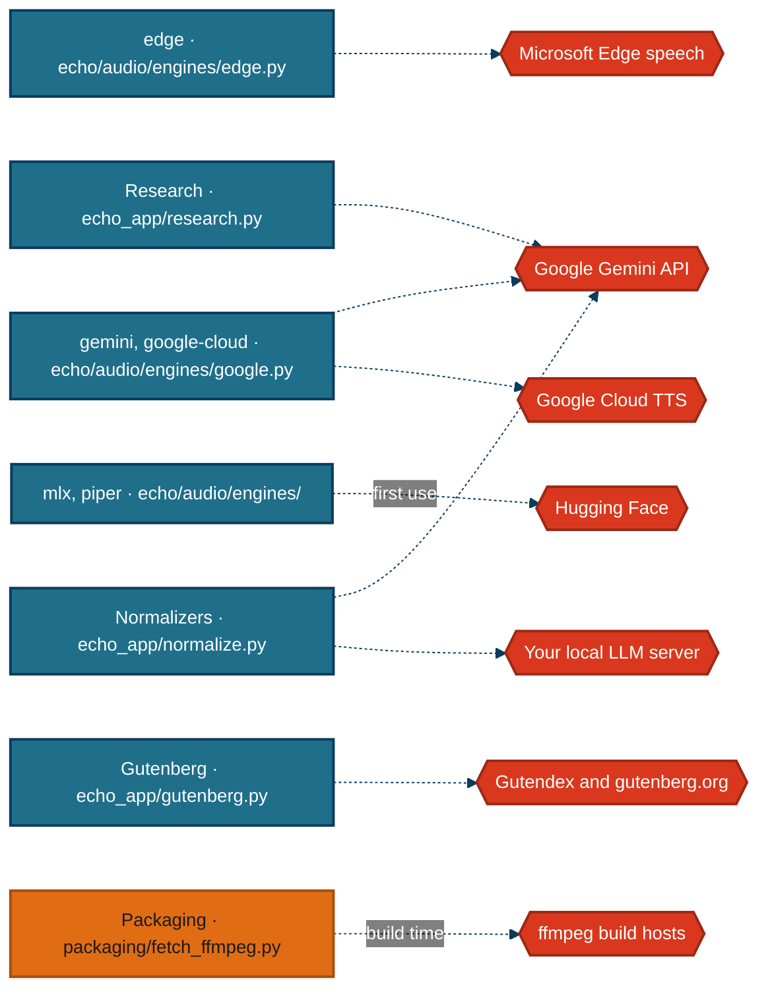

# External services and data sources

Everything echo reaches that is not on the machine running it, read from the client code rather than from the README.

## At a glance

With no key at all, the edge engine and Project Gutenberg work, and Piper works offline once a voice is downloaded.

## The services

| Service | What is sent | What comes back | Key | When it is down |
|---|---|---|---|---|
| Microsoft Edge speech, `speech.platform.bing.com` over a websocket, through the `edge-tts` package | each chunk's text, the voice and a rate such as `+25%` | MP3 audio and sentence timings | none; the client sends the Edge browser's public token | each chunk is retried with backoff, then the run fails with `SynthesisError` and keeps its chunks for resume |
| Google Gemini API, TTS | each chunk's text and a prebuilt voice name | 24 kHz PCM audio | `GEMINI_API_KEY` | retried per chunk, then `SynthesisError` |
| Google Cloud Text-to-Speech | each chunk's text, the voice and the speaking rate | MP3 audio | Application Default Credentials; API keys are refused | the engine reports itself unavailable before synthesis if credentials are missing; otherwise retried per chunk |
| Hugging Face | a download request for a Piper voice or an mlx model | model files, cached locally | none | the first chunk with a new voice fails; cached voices keep working offline |
| Gutendex, `gutendex.com` | the search terms and language, or a book id | catalogue records with download URLs | none | 3 attempts, then `GutenbergError`; the CLI exits 1 |
| gutenberg.org | a download request for the book and its cover | the EPUB or text, and a cover image | none | the book fails; a failed cover is logged and skipped |
| Google Gemini API, Deep Research | the topic, as an agent interaction | a cited Markdown report, after minutes | `GEMINI_API_KEY` | a terminal status becomes `ResearchError` naming it; a timeout cancels the interaction |
| Google Gemini API, normalization | each chunk's text and a fixed instruction | the rewritten chunk | `GEMINI_API_KEY` | the chunk keeps its original text and a warning is logged |
| Your local LLM server | each chunk's text and the instruction, to `/chat/completions` | the rewritten chunk | whatever the server expects | checked before the run starts; mid-run failures keep the original text |
| evermeet.cx and gyan.dev | a download of a static ffmpeg build, only when building `Echo.app` | a zip holding ffmpeg | none | the build script stops and prints where to get one |

**Edge is an unofficial endpoint.** It is the endpoint Microsoft Edge's Read Aloud feature uses, reached through the community `edge-tts` package. It needs no account, and it occasionally rejects a request with a websocket 403, which is why every chunk is retried.

**Gemini TTS is metered.** Gemini TTS and Deep Research draw on the key's quota. A free-tier key runs both, with a small allowance. When Deep Research runs out, it reports `budget_exceeded`, which echo turns into its own message rather than a code error.

**Google Cloud TTS has a permanent free tier** of 4 million Standard or 1 million WaveNet characters a month, per the README. That is why its engine is labelled "free tier" despite needing credentials.

**The book text goes to whichever engine you pick.** With edge, gemini or google-cloud, every sentence of the book is sent to that company's service. With mlx or piper, nothing leaves the machine after the model download.

## Attribution

The root README carries no attribution section, so it is recorded here in full.

| Source | Used for | Terms |
|---|---|---|
| Project Gutenberg | the books downloaded by `-g` and the GUI's Gutenberg dialog | public domain in the US for most titles; the Project Gutenberg licence applies to their files, and some records are hosted with permission, which echo warns about |
| Gutendex | catalogue search | a free public API over Project Gutenberg's catalogue |
| Microsoft Edge neural voices, through `edge-tts` | the default voices | Microsoft's service terms; `edge-tts` is GPL-3.0 |
| Google Gemini and Cloud Text-to-Speech | optional voices, normalization and research | Google's API terms |
| Piper voices, rhasspy/piper-voices | the offline voices | each voice's own licence, listed on its model card |
| Kokoro-82M | the mlx voices | Apache-2.0 |
| ffmpeg, through `imageio-ffmpeg` or a vendored build | joining audio and encoding | LGPL or GPL, depending on the build; the vendored build's licence is bundled beside it |

**A book made from a copyrighted Gutenberg record is not free to redistribute.** `download()` logs a warning for records the catalogue marks as copyrighted (`echo_app/gutenberg.py:277`).

*Generated from 8ed0ecc on 2026-09-28.*
