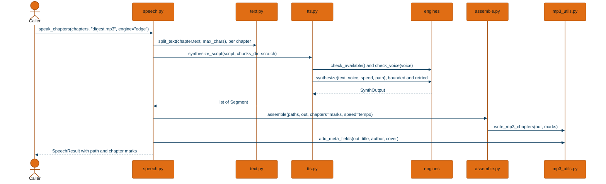
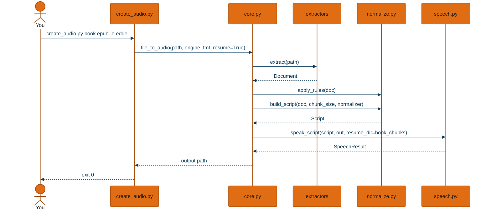
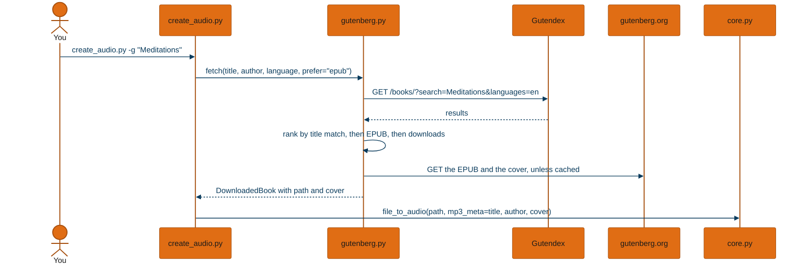
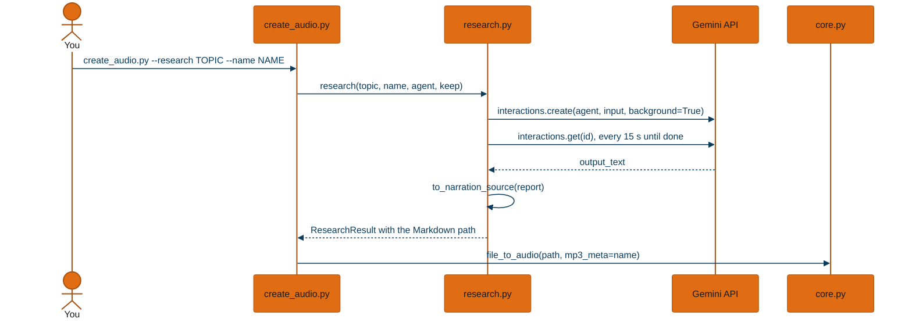
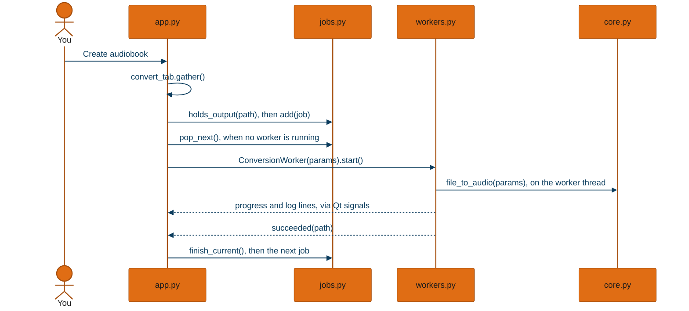
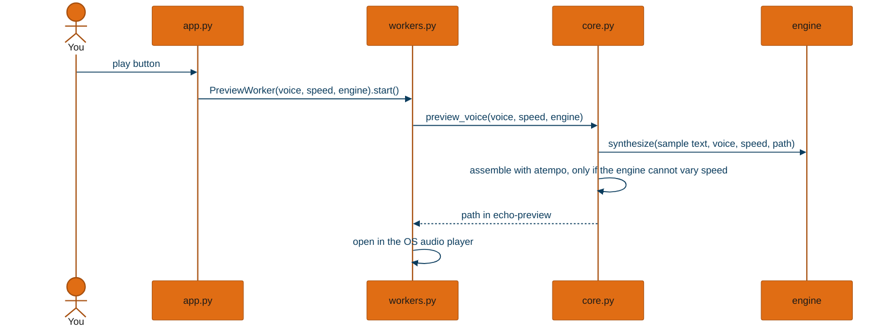

# Workflows

One trace per way in. Each diagram's participants are modules, and each message is a real call read from the source.

## Speak chapters from another program

**In plain language:** a program that already has its text, such as a weekly news digest, hands echo a list of titled chapters and a filename. It gets back one audio file with a chapter mark per chapter, and the start and end time of each.

- **The blocking call wraps an async one.** `speak_chapters` (`echo/speech.py:223`) calls `asyncio.run(aspeak_chapters(...))`, so a caller already in an event loop awaits `aspeak_chapters` (`echo/speech.py:207`) instead. The blocking steps (ffmpeg, tagging) run on a thread with `asyncio.to_thread`.
- **Scratch is private and always removed.** `aspeak_script` (`echo/speech.py:86`) makes an `echo-` folder under `work_dir` or the system temp directory and removes it in a `finally`. Chunks go there unless the caller passed `resume_dir`.
- **An unusable engine or voice fails before any audio is made.** `synthesize_script` (`echo/audio/tts.py:103`) calls `check_available()`, then `check_voice()` for every voice in the script.
- **Progress goes to both a callback and the log.** `on_progress(done, total)` counts utterances. The log line `Progress Report: NN%` counts characters, and the GUI parses that line.

## Make an audiobook from a file

**In plain language:** you point the command at a book file. echo reads its structure, decides what is spoken and where the chapters fall, then has the library read it aloud into one file beside the original.

- **The app's settings enter here as arguments.** `file_to_audio` (`echo_app/core.py:183`) passes `.env` values (bitrate, retries, backoff) into `speak_script` at `echo_app/core.py:247`, and asks for a resume folder named `<name>_chunks` beside the output.
- **An LLM normalizer is checked before any audio is made.** `build_script` in `echo_app/core.py:162` calls `check_available()` on the chosen normalizer before building the Script, so a missing model server fails the command rather than falling back for every chunk.
- **A setup problem is an exit code, not a crash.** `create_audio.py` catches `EngineUnavailable` and `NormalizerUnavailable` and returns 1. Other failures propagate and also exit non-zero.

## Find a book on Project Gutenberg and convert it

**In plain language:** you give a title instead of a file. echo searches the free catalogue, picks the best match, downloads it with its cover, and then makes the audiobook exactly as for a file.

- **Ranking is title relevance, then EPUB availability, then popularity** (`echo_app/gutenberg.py:212`). An exact title match earns nothing extra, because Gutenberg's canonical editions usually carry a subtitle.
- **Downloads are cached by book id** in `~/.cache/echo/gutenberg`, so trying a second voice does not fetch the book again (`echo_app/gutenberg.py:263`).
- **A missing cover never fails a book** (`echo_app/gutenberg.py:313`).
- `--list-matches` stops after the search and prints ids; `--gutenberg-id` skips the search.

## Research a topic and narrate the report

**In plain language:** you give a topic and a name. Gemini Deep Research spends several minutes searching the web and writing a cited report. echo strips the citations out of the spoken version, keeps them in a notes file if you asked, and reads the report aloud.

- **A run that times out is cancelled, not abandoned** (`echo_app/research.py:269`), since the service bills while it works.
- **Progress is reported on a clock, not on search counts.** The API exposes no search steps mid-run, so a line prints at least every 45 seconds.

## Queue books in the desktop app

**In plain language:** you choose a book and press Create audiobook. If another book is already being made, the new one waits in a queue, and the window works through the queue one book at a time, showing progress and a log.

- **Enqueueing is `_on_convert`** (`gui/app.py:1463`): it refuses a second job for an output file already queued, adds the job, and starts it if nothing is running.
- **A batch reports once.** Results collect while the queue drains, and one summary appears at the end (`gui/app.py:1438`). A single book keeps its own success or error dialog.

## Preview a voice

**In plain language:** press the play button beside a voice to hear a short sample at the chosen speed.

- **`preview_voice` is the only preview implementation** (`echo_app/core.py:96`), and the file name is a slug of engine and voice, so one file per voice is overwritten rather than piling up.

## Not traced here

| Workflow | Why not |
|---|---|
| `bulk_generate.py` | it runs "make an audiobook from a file" for every supported file in a folder, and reports the failures at the end |
| `--list-engines`, `--list-voices` | they print from the engine registry and exit |
| `text_to_mp3`, `file_to_mp3` | thin wrappers over the same pipeline, kept for older callers |
| Building `Echo.app` | a manual build step, described in [architecture.md](./architecture.md) |
| The `/research` Claude command | `.claude/commands/research.md` writes a Markdown report that the file workflow then reads; it has no echo code of its own |
| Refreshing the edge voice list | `echo/audio/voices.py`, run by hand to rewrite `echo/data/voices.csv` |

*Generated from 8ed0ecc on 2026-09-28.*
